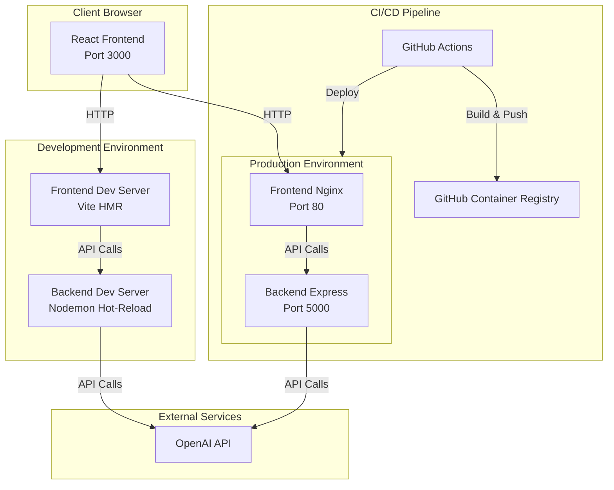

# Task Generator Web Application - Implementation Plan

## Architecture Overview



## Implementation Phases

### Phase 1: Backend Setup (Node.js + Express)

**1.1 Project Structure & Configuration**

- Create `backend/` directory with standard Express structure
- Initialize `package.json` with dependencies: `express`, `cors`, `dotenv`, `openai`, `express-validator`
- Add dev dependencies: `nodemon`, `jest`, `supertest`, `eslint`
- Create folder structure: `src/config/`, `src/controllers/`, `src/services/`, `src/routes/`, `src/middleware/`, `src/tests/`

**1.2 Core Files**

- `backend/src/index.js` - Express server setup with CORS, logging, error handling, graceful shutdown
- `backend/src/services/openai.service.js` - OpenAI client configuration, task extraction function with structured JSON response
- `backend/src/controllers/tasks.controller.js` - Request validation, error handling, response formatting
- `backend/src/routes/tasks.routes.js` - POST `/api/tasks/generate` and GET `/api/health` endpoints
- `backend/src/middleware/errorHandler.js` - Centralized error handling middleware
- `backend/src/middleware/logger.js` - Request logging middleware

**1.3 Environment Configuration**

- `backend/config/dev.env` - Development variables (PORT=5000, NODE_ENV=development)
- `backend/config/prod.env` - Production variables (with placeholders)
- `backend/.env.example` - Template with all required variables including `OPENAI_API_KEY`, `OPENAI_MODEL` (configurable)

**1.4 Docker Configuration**

- `backend/Dockerfile` - Multi-stage build:
  - Development stage: `node:20` with nodemon for hot-reload
  - Production stage: `node:20-alpine` optimized build
- `backend/.dockerignore` - Exclude node_modules, .env, logs, .git

**1.5 Testing**

- `backend/src/tests/tasks.test.js` - Unit tests for task generation endpoint
- `backend/src/tests/health.test.js` - Health check endpoint tests
- Update `package.json` with test scripts

### Phase 2: Frontend Setup (React + Vite)

**2.1 Project Initialization**

- Initialize Vite React project in `frontend/` directory
- Install dependencies: `axios`, `react-hook-form`, `tailwindcss`, `autoprefixer`, `postcss`
- Configure Tailwind CSS with `tailwind.config.js` and `postcss.config.js`

**2.2 Component Structure**

- `frontend/src/components/MeetingMinutesInput.jsx` - Textarea with form validation
- `frontend/src/components/TaskCard.jsx` - Display task with subject, criteria, action items, assignee, priority badge
- `frontend/src/components/TaskList.jsx` - Grid/list container for TaskCard components
- `frontend/src/components/LoadingSpinner.jsx` - Loading state component
- `frontend/src/components/ErrorMessage.jsx` - Error display with retry option

**2.3 Services & State Management**

- `frontend/src/services/api.service.js` - Axios configuration with base URL, `generateTasks()` function, error handling
- `frontend/src/App.jsx` - Main application with state management (useState hooks), form submission handler, result display

**2.4 Environment Configuration**

- `frontend/.env.development` - `VITE_API_URL=http://localhost:5000`
- `frontend/.env.production` - `VITE_API_URL` placeholder for production
- `frontend/.env.example` - Template file

**2.5 Docker Configuration**

- `frontend/Dockerfile` - Multi-stage build:
  - Development stage: `node:20` with Vite dev server (HMR enabled)
  - Production stage: `nginx:alpine` serving built static files
- `frontend/.dockerignore` - Exclude node_modules, dist, .env files

**2.6 Testing**

- Install `@testing-library/react`, `@testing-library/jest-dom`, `vitest`
- `frontend/src/tests/App.test.jsx` - Basic component tests
- `frontend/src/tests/api.service.test.js` - API service tests

### Phase 3: Docker Compose & DevOps

**3.1 Development Environment**

- `docker-compose.dev.yml`:
  - Backend service: dev target, volume mounts for hot-reload, port 5000
  - Frontend service: dev target, volume mounts for HMR, port 3000
  - Shared network: `task-generator-dev`
  - Environment files from `backend/config/dev.env` and `frontend/.env.development`

**3.2 Production Environment**

- `docker-compose.prod.yml`:
  - Backend service: prod target, port 5000, restart policy, health checks
  - Frontend service: prod target, port 80, restart policy, health checks
  - Shared network: `task-generator-prod`
  - Environment files from `backend/config/prod.env` and `frontend/.env.production`

**3.3 Startup Scripts**

- `start-dev.sh` - Build and start dev environment, display logs, health checks
- `start-prod.sh` - Build and start prod environment in detached mode, health checks
- Make both scripts executable

**3.4 CI/CD Pipeline (GitHub Actions)**

**3.4.1 CI Workflow** (`.github/workflows/ci.yml`)

- Triggers: push to main/develop, pull requests
- Jobs:
  - Backend: lint, test, build Docker image
  - Frontend: lint, test, build Docker image
  - Integration: docker-compose smoke tests

**3.4.2 CD Development** (`.github/workflows/cd-dev.yml`)

- Trigger: push to develop branch
- Build and push images to `ghcr.io` with `dev` tag
- Deploy to development environment (assumes deployment server configured)

**3.4.3 CD Production** (`.github/workflows/cd-prod.yml`)

- Trigger: push to main branch or manual dispatch
- Build and push images to `ghcr.io` with `latest` and version tags
- Deploy to production environment
- Post-deployment health checks

**Required GitHub Secrets:**

- `OPENAI_API_KEY` - OpenAI API key
- `GHCR_TOKEN` - GitHub Container Registry token
- `DEPLOY_DEV_HOST` - Development server host (optional)
- `DEPLOY_PROD_HOST` - Production server host (optional)

### Phase 4: Documentation & Configuration

**4.1 Root Level Files**

- `.gitignore` - Comprehensive ignore patterns (node_modules, .env*, dist, build, logs, Docker volumes)
- `README.md` - Complete documentation:
  - Project overview and features
  - Architecture diagram
  - Prerequisites and installation
  - Development setup (local and Docker)
  - Environment variables reference
  - API documentation (endpoints, request/response formats)
  - Deployment guide (dev and prod)
  - Troubleshooting section
  - Contributing guidelines

**4.2 Example Files**

- `docker-compose.override.yml.example` - Example override configuration
- Update all `.env.example` files with comprehensive comments

## Key Implementation Details

### OpenAI Service Response Structure

```javascript
{
  tasks: [
    {
      subject: "string",
      criteria: "string",
      actionItems: ["string"],
      assignee: "string",
      priority: "high" | "medium" | "low"
    }
  ]
}
```

### API Endpoints

- `POST /api/tasks/generate`
  - Request: `{ meetingMinutes: string }`
  - Response: `{ tasks: Task[] }`
- `GET /api/health`
  - Response: `{ status: "ok", timestamp: string }`

### Hot-Reload Configuration

- Backend: Nodemon watches `src/` directory, restarts on file changes
- Frontend: Vite HMR configured for React components, CSS, and assets

### Security Considerations

- CORS configured for specific origins (development: `http://localhost:3000`, production: configurable)
- API keys stored in environment variables only
- Input validation on backend (express-validator)
- Error messages don't expose sensitive information

## File Structure Summary

```
task-generator/
├── .github/workflows/
│   ├── ci.yml
│   ├── cd-dev.yml
│   └── cd-prod.yml
├── backend/
│   ├── src/
│   │   ├── config/
│   │   ├── controllers/tasks.controller.js
│   │   ├── services/openai.service.js
│   │   ├── routes/tasks.routes.js
│   │   ├── middleware/errorHandler.js, logger.js
│   │   ├── tests/tasks.test.js, health.test.js
│   │   └── index.js
│   ├── config/dev.env, prod.env
│   ├── Dockerfile
│   ├── .dockerignore
│   ├── package.json
│   └── .env.example
├── frontend/
│   ├── src/
│   │   ├── components/ (5 components)
│   │   ├── services/api.service.js
│   │   ├── tests/App.test.jsx, api.service.test.js
│   │   ├── App.jsx
│   │   └── main.jsx
│   ├── Dockerfile
│   ├── .dockerignore
│   ├── package.json
│   ├── tailwind.config.js
│   ├── postcss.config.js
│   ├── .env.development, .env.production
│   └── .env.example
├── docker-compose.dev.yml
├── docker-compose.prod.yml
├── start-dev.sh
├── start-prod.sh
├── .gitignore
└── README.md
```

## Testing Strategy

- Backend: Unit tests for OpenAI service, integration tests for API endpoints
- Frontend: Component tests for UI, service tests for API calls
- CI Pipeline: Automated test execution before Docker builds
- Health checks: Implemented in both services for monitoring

## Deployment Notes

- Development: Local Docker Compose with hot-reload
- Production: Optimized Docker images, nginx for frontend, health checks enabled
- CI/CD: Automated testing, image building, and deployment on branch pushes
- Secrets management: All sensitive data via GitHub Secrets and environment files