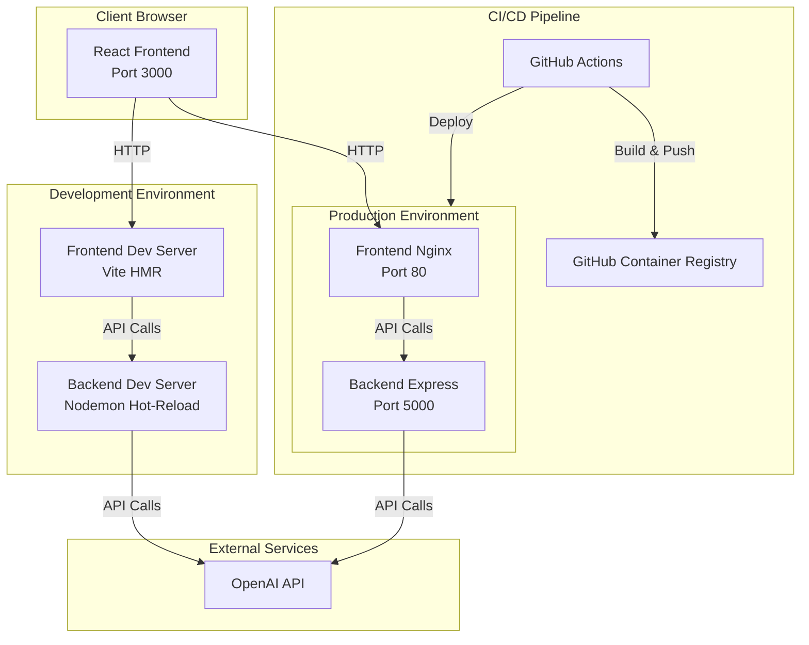

# Task Generator Web Application

A full-stack web application that automatically extracts structured tasks from meeting minutes using OpenAI's GPT models. The application consists of a React frontend and a Node.js/Express backend, with Docker support for both development and production environments.

## Features

- **AI-Powered Task Extraction**: Automatically extracts tasks from meeting minutes using OpenAI GPT models
- **Structured Task Output**: Generates tasks with subject, criteria, action items, assignee, and priority
- **Modern UI**: Built with React and Tailwind CSS for a clean, responsive interface
- **Hot-Reload Development**: Fast development experience with Vite HMR and Nodemon
- **Docker Support**: Containerized development and production environments
- **Makefile Commands**: Unified command interface for all operations with environment-specific support
- **CI/CD Pipeline**: Automated testing and deployment with GitHub Actions
- **Health Checks**: Built-in health monitoring endpoints

## Architecture



## Prerequisites

- **Node.js**: Version 20 or higher
- **npm**: Version 9 or higher
- **Make**: Usually pre-installed on Unix-like systems (macOS, Linux). For Windows, use WSL or install via package manager.
- **Docker**: Version 20.10 or higher (for Docker-based setup)
- **Docker Compose**: Version 2.0 or higher (for Docker-based setup)
- **OpenAI API Key**: Required for task generation functionality

## Quick Start

### Development Environment

The easiest way to get started with development is using the Makefile:

```bash
make start
```

Or explicitly specify the environment:

```bash
make start ENV=dev
```

This will:
- Automatically create and configure environment files
- Create `docker.env` file from `docker.env.example` for port configuration
- Prompt for your OpenAI API key
- Start services with hot-reload enabled

**Port Configuration:** Ports are configurable via the `docker.env` file. If you need to use different ports (e.g., if port 5000 is in use), edit `docker.env` before starting or after stopping services.

### Production Environment

For production deployment, use:

```bash
make start ENV=prod
```

This will:
- Interactively configure production settings
- Set up CORS for your production domain
- Build and start services in detached mode
- Perform automatic health checks
- Display service status and access URLs

### Available Make Commands

View all available commands:

```bash
make help
```

## Makefile Commands Reference

The project uses a Makefile to provide a unified interface for all operations. All commands support an optional `ENV` parameter to specify the environment (`dev` or `prod`), with `dev` being the default.

### Basic Commands

#### `make help`
Display help message with all available commands and usage examples.

```bash
make help
```

#### `make start [ENV=dev|prod]`
Start the application. Defaults to development environment.

**Development:**
```bash
make start          # Start development environment
make start ENV=dev  # Explicitly start development environment
```

**Production:**
```bash
make start ENV=prod # Start production environment
```

**What it does:**
- Checks Docker and Docker Compose availability
- Creates environment files from `.env.example` if missing
- Creates `docker.env` from `docker.env.example` for port configuration if missing
- Prompts for OpenAI API key and model if not configured
- Builds Docker images
- Starts services (foreground for dev, detached for prod)
- Performs health checks for production environment

#### `make stop [ENV=dev|prod]`
Stop the application. Defaults to development environment.

```bash
make stop           # Stop development environment
make stop ENV=prod  # Stop production environment
```

#### `make restart [ENV=dev|prod]`
Restart the application (stop then start). Defaults to development environment.

```bash
make restart         # Restart development environment
make restart ENV=prod # Restart production environment
```

### Monitoring Commands

#### `make status [ENV=dev|prod]`
Show status of running containers. Defaults to development environment.

```bash
make status          # Show development environment status
make status ENV=prod # Show production environment status
```

#### `make logs [ENV=dev|prod]`
Show logs from all running containers (follows logs in real-time). Defaults to development environment.

```bash
make logs            # Show all logs for development
make logs ENV=prod   # Show all logs for production
```

Press `Ctrl+C` to exit log viewing.

#### `make logs-backend [ENV=dev|prod]`
Show logs from backend container only. Defaults to development environment.

```bash
make logs-backend         # Backend logs for development
make logs-backend ENV=prod # Backend logs for production
```

#### `make logs-frontend [ENV=dev|prod]`
Show logs from frontend container only. Defaults to development environment.

```bash
make logs-frontend         # Frontend logs for development
make logs-frontend ENV=prod # Frontend logs for production
```

### Build Commands

#### `make build [ENV=dev|prod]`
Build Docker images without starting containers. Defaults to development environment.

```bash
make build          # Build development images
make build ENV=prod # Build production images
```

### Utility Commands

#### `make shell-backend [ENV=dev|prod]`
Open an interactive shell in the backend container. Defaults to development environment.

```bash
make shell-backend         # Shell in development backend
make shell-backend ENV=prod # Shell in production backend
```

#### `make shell-frontend [ENV=dev|prod]`
Open an interactive shell in the frontend container. Defaults to development environment.

```bash
make shell-frontend         # Shell in development frontend
make shell-frontend ENV=prod # Shell in production frontend
```

### Cleanup Commands

#### `make clean [ENV=dev|prod]`
Stop and remove containers, networks, and volumes for the specified environment. Defaults to development environment.

```bash
make clean          # Clean up development environment
make clean ENV=prod # Clean up production environment
```

**Warning:** This removes all volumes, which may delete persistent data.

#### `make clean-all`
Remove all containers, networks, volumes, and images for both development and production environments.

```bash
make clean-all
```

**Warning:** This removes all resources for both environments.

### Command Examples

**Development workflow:**
```bash
# Start development environment
make start

# View logs in another terminal
make logs

# Check status
make status

# Restart after configuration changes
make restart

# Stop when done
make stop
```

**Production workflow:**
```bash
# Start production environment
make start ENV=prod

# Monitor logs
make logs ENV=prod

# Check service health
make status ENV=prod

# View only backend logs if issues occur
make logs-backend ENV=prod

# Stop production
make stop ENV=prod
```

**Debugging:**
```bash
# Access backend container shell
make shell-backend

# Access frontend container shell
make shell-frontend

# View specific service logs
make logs-backend
make logs-frontend
```

See the [Development Setup](#development-setup) and [Deployment](#deployment) sections for detailed information.

## Installation

### Clone the Repository

```bash
git clone <repository-url>
cd task-generator
```

### Backend Setup

1. Navigate to the backend directory:
```bash
cd backend
```

2. Install dependencies:
```bash
npm install
```

3. Create environment file:
```bash
cp .env.example .env
```

4. Update `.env` with your configuration (see [Environment Variables](#environment-variables) section)

### Frontend Setup

1. Navigate to the frontend directory:
```bash
cd frontend
```

2. Install dependencies:
```bash
npm install
```

3. Create environment file:
```bash
cp .env.example .env.development
```

4. Update `.env.development` with your API URL (see [Environment Variables](#environment-variables) section)

## Development Setup

### Local Development (Without Docker)

#### Backend

1. Navigate to `backend/` directory
2. Ensure `.env` file is configured with your OpenAI API key
3. Start the development server:
```bash
npm run dev
```

The backend will be available at `http://localhost:5000`

#### Frontend

1. Navigate to `frontend/` directory
2. Ensure `.env.development` is configured with the backend API URL
3. Start the development server:
```bash
npm run dev
```

The frontend will be available at `http://localhost:3000`

### Docker Development

The Makefile provides an automated setup for the development environment with intelligent configuration management.

1. Ensure Docker and Docker Compose are installed and running

2. Start the development environment:
```bash
make start
```

Or explicitly:
```bash
make start ENV=dev
```

**What the make command does automatically:**
- ✅ Checks Docker and Docker Compose availability
- ✅ Creates `backend/.env.development` from `.env.example` if missing
- ✅ Creates `frontend/.env.development` with default API URL if missing
- ✅ Creates `docker.env` from `docker.env.example` for port configuration if missing
- ✅ Prompts for OpenAI API key if not configured (saves to `backend/.env.development`)
- ✅ Prompts for OpenAI model selection (defaults to `gpt-4o-mini`)
- ✅ Builds Docker images
- ✅ Starts services in foreground mode (logs visible in terminal)

**Access the application:**
- Frontend: `http://localhost:3000` (or port configured in `docker.env`)
- Backend API: `http://localhost:5000` (or port configured in `docker.env`)
- Health Check: `http://localhost:5000/api/tasks/health` (or port configured in `docker.env`)

**Note:** Ports are configurable via the `docker.env` file. See [Docker Environment Variables](#docker-environment-variables) section for details.

**Note:** The make command runs services in foreground mode, so you'll see logs directly in your terminal. Press `Ctrl+C` to stop the services.

**Other useful make commands for development:**

View logs:
```bash
make logs
# Or view logs for specific service:
make logs-backend
make logs-frontend
```

Check service status:
```bash
make status
```

Stop services:
```bash
make stop
```

Restart services:
```bash
make restart
```

Build images without starting:
```bash
make build
```

Open a shell in a container:
```bash
make shell-backend
make shell-frontend
```

Clean up (stop and remove containers, networks, volumes):
```bash
make clean
```

**Manual setup (alternative):**
If you prefer to set up manually:
```bash
docker-compose -f docker-compose.dev.yml up --build
```

## Environment Variables

### Docker Environment Variables

Port configuration for Docker Compose is managed through the `docker.env` file. This file is automatically created from `docker.env.example` when you run `make start` for the first time.

**Create `docker.env` file:**
```bash
cp docker.env.example docker.env
```

**Configure ports in `docker.env`:**
```env
# Backend port mapping (host:container)
# Format: "HOST_PORT:5000" where 5000 is the container's internal port
# Default: 5000
BACKEND_PORT=5000

# Frontend port mapping for development (host:container)
# Format: "HOST_PORT:3000" where 3000 is the container's internal port
# Default: 3000
FRONTEND_PORT=3000

# Frontend port mapping for production (host:container)
# Format: "HOST_PORT:80" where 80 is the container's internal port
# Default: 80
FRONTEND_PORT_PROD=80
```

**Example - Using alternative ports:**
If port 5000 is already in use (e.g., macOS AirPlay Receiver), you can configure alternative ports:

```env
BACKEND_PORT=5001
FRONTEND_PORT=3001
FRONTEND_PORT_PROD=8080
```

**Important Notes:**
- The `docker.env` file is git-ignored and will not be committed to version control
- After changing ports in `docker.env`, restart services: `make restart`
- If you change the backend port, update `frontend/.env.development` or `frontend/.env.production` to match the new backend URL
- The make commands automatically load `docker.env` when starting services

### Backend Environment Variables

The startup scripts automatically create environment files from `.env.example`, but you can also create them manually.

**For Development:**
The `start-dev.sh` script creates `backend/.env.development` automatically. You can also create it manually:

```bash
cp backend/.env.example backend/.env.development
```

Then update `backend/.env.development`:

```env
# Node Environment
NODE_ENV=development

# Server Configuration
PORT=5000

# CORS Configuration
# Development: http://localhost:3000
CORS_ORIGIN=http://localhost:3000

# OpenAI Configuration
# Required: Your OpenAI API key
OPENAI_API_KEY=sk-your-api-key-here

# Optional: OpenAI model to use (default: gpt-4o-mini)
OPENAI_MODEL=gpt-4o-mini
```

**For Production:**
The `start-prod.sh` script creates `backend/.env.production` automatically. You can also create it manually:

```bash
cp backend/.env.example backend/.env.production
```

Then update `backend/.env.production`:

```env
# Node Environment
NODE_ENV=production

# Server Configuration
PORT=5000

# CORS Configuration
# Production: https://your-frontend-domain.com
CORS_ORIGIN=https://your-frontend-domain.com

# OpenAI Configuration
# Required: Your OpenAI API key
OPENAI_API_KEY=sk-your-api-key-here

# Optional: OpenAI model to use (default: gpt-4o-mini)
OPENAI_MODEL=gpt-4o-mini
```

**Note:** The make commands will prompt you for the OpenAI API key and model if they're not already configured, making the setup process interactive and user-friendly.

### Frontend Environment Variables

**For Development:**
The `make start` command automatically creates `frontend/.env.development` with the default API URL. You can also create it manually:

```bash
cp frontend/.env.example frontend/.env.development
```

Then update `frontend/.env.development`:

```env
# Backend API URL for development
VITE_API_URL=http://localhost:5000
```

**Note:** If you change the backend port in `docker.env`, you should update `VITE_API_URL` in this file to match the new backend port.

**For Production:**
The `make start ENV=prod` command automatically creates `frontend/.env.production` with default values if missing. You can also create it manually:

```bash
cp frontend/.env.example frontend/.env.production
```

Then update `frontend/.env.production`:

```env
# Backend API URL for production
VITE_API_URL=https://api.your-domain.com
```

**Note:** If you change the backend port in `docker.env`, you should update `VITE_API_URL` in this file to match the new backend port.

## API Documentation

### Base URL

- **Development**: `http://localhost:5000`
- **Production**: `https://api.your-domain.com`

### Endpoints

#### Generate Tasks

**POST** `/api/tasks/generate`

Extracts structured tasks from meeting minutes.

**Request Body:**
```json
{
  "meetingMinutes": "Meeting minutes text here..."
}
```

**Request Validation:**
- `meetingMinutes` (required): String, minimum 10 characters

**Success Response** (200 OK):
```json
{
  "tasks": [
    {
      "subject": "Implement user authentication",
      "criteria": "Users can log in with email and password, session is maintained for 24 hours",
      "actionItems": [
        "Set up authentication middleware",
        "Create login endpoint",
        "Implement session management"
      ],
      "assignee": "John Doe",
      "priority": "high"
    }
  ]
}
```

**Error Responses:**

- **400 Bad Request**: Validation error
```json
{
  "error": {
    "message": "Validation failed",
    "details": [
      {
        "msg": "meetingMinutes must be at least 10 characters long",
        "param": "meetingMinutes",
        "location": "body"
      }
    ]
  }
}
```

- **500 Internal Server Error**: Server or OpenAI API error
```json
{
  "error": {
    "message": "Failed to generate tasks. Please try again."
  }
}
```

#### Health Check

**GET** `/api/tasks/health`

Returns the health status of the API.

**Success Response** (200 OK):
```json
{
  "status": "ok",
  "timestamp": "2024-01-15T10:30:00.000Z"
}
```

#### Root Endpoint

**GET** `/`

Returns API information.

**Success Response** (200 OK):
```json
{
  "message": "Task Generator API",
  "version": "1.0.0"
}
```

### Task Object Structure

Each task in the response contains:

- **subject** (string): Clear, concise title for the task
- **criteria** (string): Acceptance criteria or definition of done
- **actionItems** (array of strings): Specific action items needed to complete the task
- **assignee** (string): Person responsible (or "Unassigned" if not specified)
- **priority** (string): One of `"high"`, `"medium"`, or `"low"`

## Deployment

### Production Docker Setup

The Makefile provides a comprehensive, automated setup for the production environment with interactive configuration, intelligent port management, and automated health verification.

#### Quick Start

1. Ensure Docker and Docker Compose are installed and running

2. Start the production environment:
```bash
make start ENV=prod
```

The make command will guide you through the entire setup process interactively.

#### Complete Capabilities

**Pre-flight Checks:**
- ✅ Verifies Docker and Docker Compose are installed and available
- ✅ Checks if Docker daemon is running
- ✅ Validates required files exist (e.g., `backend/.env.example`)

**Environment Configuration:**
- ✅ Automatically creates `backend/.env.production` from `.env.example` if missing
- ✅ Automatically creates `frontend/.env.production` with default values if missing
- ✅ Prompts for production frontend URL for CORS configuration (with default option)
- ✅ Prompts for OpenAI API key if not configured (saves securely to `backend/.env.production`)
- ✅ Prompts for OpenAI model selection (defaults to `gpt-4o-mini`)
- ✅ Handles existing configuration gracefully (uses existing values if already set)

**Port Configuration:**
- ✅ Creates `docker.env` from `docker.env.example` if missing
- ✅ Ports are configurable via `docker.env` file (see [Docker Environment Variables](#docker-environment-variables))
- ✅ Default ports: Backend 5000, Frontend 3000 (dev) / 80 (prod)

**Docker Operations:**
- ✅ Builds optimized production Docker images
- ✅ Starts services in detached mode (runs in background)
- ✅ Waits for services to initialize before health checks

**Health Verification:**
- ✅ Performs automatic health checks for backend service (up to 30 attempts, 2-second intervals)
- ✅ Performs automatic health checks for frontend service (up to 30 attempts, 2-second intervals)
- ✅ Displays detailed health check progress
- ✅ Shows service logs if health checks fail
- ✅ Exits with error code if services fail to become healthy

**Post-Deployment Information:**
- ✅ Displays service status table
- ✅ Shows access URLs for all services
- ✅ Provides helpful commands for log viewing and stopping

**Error Handling:**
- ✅ Graceful error messages with actionable guidance
- ✅ Automatic cleanup on failure
- ✅ Detailed logging for troubleshooting

#### Production Make Commands

**View logs:**
```bash
make logs ENV=prod
# Or view logs for specific service:
make logs-backend ENV=prod
make logs-frontend ENV=prod
```

**Check service status:**
```bash
make status ENV=prod
```

**Stop services:**
```bash
make stop ENV=prod
```

**Restart services:**
```bash
make restart ENV=prod
```

**Build images without starting:**
```bash
make build ENV=prod
```

**Open a shell in a container:**
```bash
make shell-backend ENV=prod
make shell-frontend ENV=prod
```

**Clean up (stop and remove containers, networks, volumes):**
```bash
make clean ENV=prod
```

**Clean up all environments:**
```bash
make clean-all
```

**Check health:**
```bash
curl http://localhost:5000/api/tasks/health
```

**Access the application:**
- Frontend: `http://localhost:80` (or port configured in `docker.env` via `FRONTEND_PORT_PROD`)
- Backend API: `http://localhost:5000` (or port configured in `docker.env` via `BACKEND_PORT`)
- Health Check: `http://localhost:5000/api/tasks/health` (or port configured in `docker.env`)

**Note:** Ports are configurable via the `docker.env` file. See [Docker Environment Variables](#docker-environment-variables) section for details.

#### Manual Setup (Alternative)

If you prefer to set up manually without using make, ensure environment files are configured:
- `backend/.env.production` (or `backend/config/prod.env`)
- `frontend/.env.production`

Then run:
```bash
docker-compose -f docker-compose.prod.yml up -d --build
```

**Note:** Manual setup requires you to:
- Create and configure all environment files yourself
- Handle port conflicts manually
- Perform health checks manually
- Monitor service startup yourself

The make commands automate all of these steps for a smoother deployment experience.

### CI/CD Pipeline

The project includes GitHub Actions workflows for automated CI/CD:

#### CI Workflow (`.github/workflows/ci.yml`)

- Triggers on push to `main`/`develop` branches and pull requests
- Runs linting and tests for both backend and frontend
- Builds Docker images
- Runs integration tests

#### CD Development (`.github/workflows/cd-dev.yml`)

- Triggers on push to `develop` branch
- Builds and pushes images to GitHub Container Registry with `dev` tag
- Deploys to development environment

#### CD Production (`.github/workflows/cd-prod.yml`)

- Triggers on push to `main` branch or manual dispatch
- Builds and pushes images with `latest` and version tags
- Deploys to production environment
- Runs post-deployment health checks

**Required GitHub Secrets:**
- `OPENAI_API_KEY`: OpenAI API key
- `GHCR_TOKEN`: GitHub Container Registry authentication token
- `DEPLOY_DEV_HOST`: Development server host (optional)
- `DEPLOY_PROD_HOST`: Production server host (optional)

## Testing

### Backend Tests

Run backend tests:
```bash
cd backend
npm test
```

Run tests with coverage:
```bash
npm run test:coverage
```

Run tests in watch mode:
```bash
npm run test:watch
```

### Frontend Tests

Run frontend tests:
```bash
cd frontend
npm test
```

### Integration Tests

Run integration tests with Docker Compose:
```bash
docker-compose -f docker-compose.dev.yml up -d
npm run test:integration
docker-compose -f docker-compose.dev.yml down
```

## Troubleshooting

### Backend Issues

#### Server won't start

- **Check port availability**: Ensure port 5000 is not in use
- **Verify environment variables**: Ensure `.env` file exists and contains required variables
- **Check OpenAI API key**: Verify `OPENAI_API_KEY` is set correctly

#### OpenAI API errors

- **Invalid API key**: Verify your OpenAI API key is correct and has sufficient credits
- **Rate limiting**: Check if you've exceeded API rate limits
- **Model availability**: Ensure the specified model (`OPENAI_MODEL`) is available

#### CORS errors

- **Check CORS_ORIGIN**: Ensure `CORS_ORIGIN` in backend `.env` matches your frontend URL
- **Development**: Should be `http://localhost:3000`
- **Production**: Should match your production frontend domain

### Frontend Issues

#### Cannot connect to backend

- **Check API URL**: Verify `VITE_API_URL` in `.env.development` or `.env.production`
- **Backend running**: Ensure backend server is running and accessible
- **Network issues**: Check firewall and network connectivity

#### Build errors

- **Node version**: Ensure Node.js version 20+ is installed
- **Dependencies**: Run `npm install` to ensure all dependencies are installed
- **Environment variables**: Ensure all required environment variables are set

### Docker Issues

#### Containers won't start

- **Docker running**: Ensure Docker daemon is running
- **Port conflicts**: 
  - Ports are configurable via the `docker.env` file
  - If port 5000 is already in use (e.g., macOS AirPlay Receiver), edit `docker.env` and set `BACKEND_PORT=5001` (or another available port)
  - On macOS, port 5000 is often used by AirPlay Receiver (disable in System Settings > General > AirDrop & Handoff, or use alternative port in `docker.env`)
  - After changing ports, restart services: `make restart`
  - Remember to update `frontend/.env.development` or `frontend/.env.production` if you change the backend port
- **Build errors**: Check Docker build logs: `make logs` or `docker-compose logs`

#### Hot-reload not working

- **Volume mounts**: Verify volumes are correctly mounted in `docker-compose.dev.yml`
- **File permissions**: Ensure files have correct permissions for Docker user

#### Image build failures

- **Dockerfile syntax**: Check Dockerfile syntax and base images
- **Network issues**: Ensure Docker can pull base images from Docker Hub
- **Build context**: Ensure you're running commands from the correct directory

### General Issues

#### Environment variables not loading

- **File location**: Ensure `.env` files are in the correct directories
- **File naming**: 
  - Backend: Use `.env.development` for development, `.env.production` for production
  - Frontend: Use `.env.development` for development, `.env.production` for production
- **Auto-creation**: The make commands automatically create these files from `.env.example` if they don't exist
- **Restart required**: Restart services after changing environment variables using `make restart`
- **Make prompts**: The make commands will prompt you for required values (OpenAI API key, model, etc.) if not already set

#### Module not found errors

- **Dependencies**: Run `npm install` in the affected directory
- **Node modules**: Delete `node_modules` and reinstall: `rm -rf node_modules && npm install`

## Project Structure

```
task-generator/
├── .github/workflows/          # CI/CD pipeline configurations
│   ├── ci.yml                  # Continuous Integration workflow
│   ├── cd-dev.yml             # Development deployment workflow
│   └── cd-prod.yml            # Production deployment workflow
├── backend/                    # Backend application
│   ├── src/
│   │   ├── config/            # Configuration files
│   │   ├── controllers/     # Request handlers
│   │   │   └── tasks.controller.js
│   │   ├── services/          # Business logic
│   │   │   └── openai.service.js
│   │   ├── routes/            # API routes
│   │   │   └── tasks.routes.js
│   │   ├── middleware/        # Express middleware
│   │   │   ├── errorHandler.js
│   │   │   └── logger.js
│   │   ├── tests/             # Test files
│   │   │   ├── tasks.test.js
│   │   │   └── health.test.js
│   │   └── index.js           # Application entry point
│   ├── config/                # Environment configurations
│   │   ├── dev.env
│   │   └── prod.env
│   ├── Dockerfile             # Docker configuration
│   ├── .dockerignore          # Docker ignore patterns
│   ├── package.json           # Dependencies and scripts
│   └── .env.example           # Environment variables template
├── frontend/                   # Frontend application
│   ├── src/
│   │   ├── components/        # React components
│   │   ├── services/          # API service layer
│   │   ├── tests/             # Test files
│   │   ├── App.jsx            # Main application component
│   │   └── main.jsx           # Application entry point
│   ├── Dockerfile             # Docker configuration
│   ├── .dockerignore          # Docker ignore patterns
│   ├── package.json           # Dependencies and scripts
│   ├── tailwind.config.js     # Tailwind CSS configuration
│   ├── postcss.config.js      # PostCSS configuration
│   ├── .env.development       # Development environment variables
│   ├── .env.production        # Production environment variables
│   └── .env.example           # Environment variables template
├── docker-compose.dev.yml     # Development Docker Compose configuration
├── docker-compose.prod.yml    # Production Docker Compose configuration
├── docker.env.example         # Docker environment variables template
├── Makefile                   # Make commands for all operations
├── scripts/
│   └── start.sh               # Unified startup script (used by make)
├── .gitignore                 # Git ignore patterns
└── README.md                  # This file
```

## Contributing

1. Fork the repository
2. Create a feature branch (`git checkout -b feature/amazing-feature`)
3. Make your changes
4. Run tests (`npm test`)
5. Commit your changes (`git commit -m 'Add some amazing feature'`)
6. Push to the branch (`git push origin feature/amazing-feature`)
7. Open a Pull Request

### Code Style

- Follow existing code style and patterns
- Run linters before committing: `npm run lint`
- Write tests for new features
- Update documentation as needed

## License

ISC

## Support

For issues, questions, or contributions, please open an issue on the GitHub repository.
