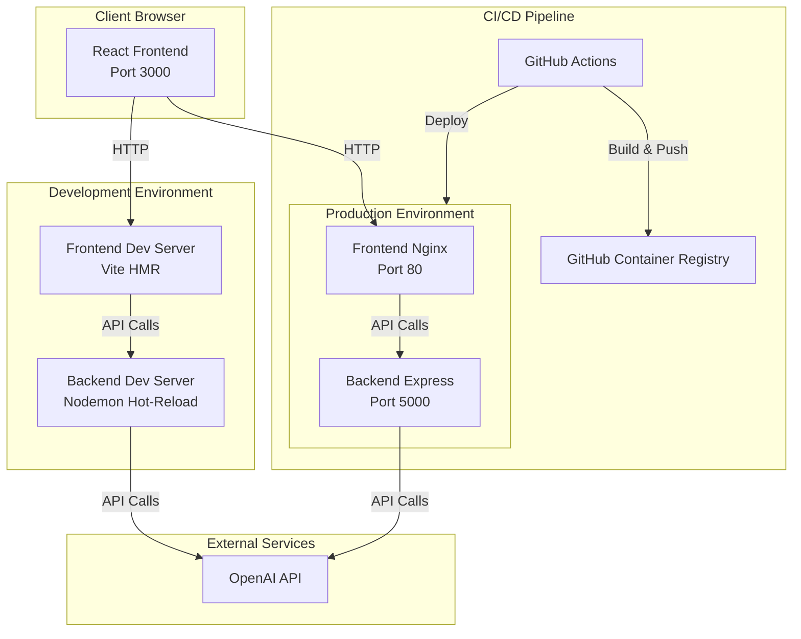

# Task Generator Web Application

A full-stack web application that automatically extracts structured tasks from meeting minutes using OpenAI's GPT models. The application consists of a React frontend and a Node.js/Express backend, with Docker support for both development and production environments.

## Features

- **AI-Powered Task Extraction**: Automatically extracts tasks from meeting minutes using OpenAI GPT models
- **Structured Task Output**: Generates tasks with subject, criteria, action items, assignee, and priority
- **Modern UI**: Built with React and Tailwind CSS for a clean, responsive interface
- **Hot-Reload Development**: Fast development experience with Vite HMR and Nodemon
- **Docker Support**: Containerized development and production environments
- **CI/CD Pipeline**: Automated testing and deployment with GitHub Actions
- **Health Checks**: Built-in health monitoring endpoints

## Architecture



## Prerequisites

- **Node.js**: Version 20 or higher
- **npm**: Version 9 or higher
- **Docker**: Version 20.10 or higher (for Docker-based setup)
- **Docker Compose**: Version 2.0 or higher (for Docker-based setup)
- **OpenAI API Key**: Required for task generation functionality

## Installation

### Clone the Repository

```bash
git clone <repository-url>
cd task-generator
```

### Backend Setup

1. Navigate to the backend directory:
```bash
cd backend
```

2. Install dependencies:
```bash
npm install
```

3. Create environment file:
```bash
cp .env.example .env
```

4. Update `.env` with your configuration (see [Environment Variables](#environment-variables) section)

### Frontend Setup

1. Navigate to the frontend directory:
```bash
cd frontend
```

2. Install dependencies:
```bash
npm install
```

3. Create environment file:
```bash
cp .env.example .env.development
```

4. Update `.env.development` with your API URL (see [Environment Variables](#environment-variables) section)

## Development Setup

### Local Development (Without Docker)

#### Backend

1. Navigate to `backend/` directory
2. Ensure `.env` file is configured with your OpenAI API key
3. Start the development server:
```bash
npm run dev
```

The backend will be available at `http://localhost:5000`

#### Frontend

1. Navigate to `frontend/` directory
2. Ensure `.env.development` is configured with the backend API URL
3. Start the development server:
```bash
npm run dev
```

The frontend will be available at `http://localhost:3000`

### Docker Development

1. Ensure Docker and Docker Compose are installed and running

2. Start the development environment:
```bash
./start-dev.sh
```

Or manually:
```bash
docker-compose -f docker-compose.dev.yml up --build
```

This will:
- Build both frontend and backend containers
- Start services with hot-reload enabled
- Mount volumes for live code updates
- Expose frontend on port 3000 and backend on port 5000

3. Access the application:
   - Frontend: `http://localhost:3000`
   - Backend API: `http://localhost:5000`
   - Health Check: `http://localhost:5000/api/tasks/health`

4. View logs:
```bash
docker-compose -f docker-compose.dev.yml logs -f
```

5. Stop the environment:
```bash
docker-compose -f docker-compose.dev.yml down
```

## Environment Variables

### Backend Environment Variables

Create a `.env` file in the `backend/` directory:

```env
# Node Environment
NODE_ENV=development

# Server Configuration
PORT=5000

# CORS Configuration
# Development: http://localhost:3000
# Production: https://your-frontend-domain.com
CORS_ORIGIN=http://localhost:3000

# OpenAI Configuration
# Required: Your OpenAI API key
OPENAI_API_KEY=sk-your-api-key-here

# Optional: OpenAI model to use (default: gpt-4o-mini)
OPENAI_MODEL=gpt-4o-mini
```

### Frontend Environment Variables

Create `.env.development` and `.env.production` files in the `frontend/` directory:

**`.env.development`**:
```env
# Backend API URL for development
VITE_API_URL=http://localhost:5000
```

**`.env.production`**:
```env
# Backend API URL for production
VITE_API_URL=https://api.your-domain.com
```

## API Documentation

### Base URL

- **Development**: `http://localhost:5000`
- **Production**: `https://api.your-domain.com`

### Endpoints

#### Generate Tasks

**POST** `/api/tasks/generate`

Extracts structured tasks from meeting minutes.

**Request Body:**
```json
{
  "meetingMinutes": "Meeting minutes text here..."
}
```

**Request Validation:**
- `meetingMinutes` (required): String, minimum 10 characters

**Success Response** (200 OK):
```json
{
  "tasks": [
    {
      "subject": "Implement user authentication",
      "criteria": "Users can log in with email and password, session is maintained for 24 hours",
      "actionItems": [
        "Set up authentication middleware",
        "Create login endpoint",
        "Implement session management"
      ],
      "assignee": "John Doe",
      "priority": "high"
    }
  ]
}
```

**Error Responses:**

- **400 Bad Request**: Validation error
```json
{
  "error": {
    "message": "Validation failed",
    "details": [
      {
        "msg": "meetingMinutes must be at least 10 characters long",
        "param": "meetingMinutes",
        "location": "body"
      }
    ]
  }
}
```

- **500 Internal Server Error**: Server or OpenAI API error
```json
{
  "error": {
    "message": "Failed to generate tasks. Please try again."
  }
}
```

#### Health Check

**GET** `/api/tasks/health`

Returns the health status of the API.

**Success Response** (200 OK):
```json
{
  "status": "ok",
  "timestamp": "2024-01-15T10:30:00.000Z"
}
```

#### Root Endpoint

**GET** `/`

Returns API information.

**Success Response** (200 OK):
```json
{
  "message": "Task Generator API",
  "version": "1.0.0"
}
```

### Task Object Structure

Each task in the response contains:

- **subject** (string): Clear, concise title for the task
- **criteria** (string): Acceptance criteria or definition of done
- **actionItems** (array of strings): Specific action items needed to complete the task
- **assignee** (string): Person responsible (or "Unassigned" if not specified)
- **priority** (string): One of `"high"`, `"medium"`, or `"low"`

## Deployment

### Production Docker Setup

1. Ensure all environment variables are configured in:
   - `backend/config/prod.env`
   - `frontend/.env.production`

2. Build and start production containers:
```bash
./start-prod.sh
```

Or manually:
```bash
docker-compose -f docker-compose.prod.yml up -d --build
```

3. Verify services are running:
```bash
docker-compose -f docker-compose.prod.yml ps
```

4. Check health:
```bash
curl http://localhost:5000/api/tasks/health
```

### CI/CD Pipeline

The project includes GitHub Actions workflows for automated CI/CD:

#### CI Workflow (`.github/workflows/ci.yml`)

- Triggers on push to `main`/`develop` branches and pull requests
- Runs linting and tests for both backend and frontend
- Builds Docker images
- Runs integration tests

#### CD Development (`.github/workflows/cd-dev.yml`)

- Triggers on push to `develop` branch
- Builds and pushes images to GitHub Container Registry with `dev` tag
- Deploys to development environment

#### CD Production (`.github/workflows/cd-prod.yml`)

- Triggers on push to `main` branch or manual dispatch
- Builds and pushes images with `latest` and version tags
- Deploys to production environment
- Runs post-deployment health checks

**Required GitHub Secrets:**
- `OPENAI_API_KEY`: OpenAI API key
- `GHCR_TOKEN`: GitHub Container Registry authentication token
- `DEPLOY_DEV_HOST`: Development server host (optional)
- `DEPLOY_PROD_HOST`: Production server host (optional)

## Testing

### Backend Tests

Run backend tests:
```bash
cd backend
npm test
```

Run tests with coverage:
```bash
npm run test:coverage
```

Run tests in watch mode:
```bash
npm run test:watch
```

### Frontend Tests

Run frontend tests:
```bash
cd frontend
npm test
```

### Integration Tests

Run integration tests with Docker Compose:
```bash
docker-compose -f docker-compose.dev.yml up -d
npm run test:integration
docker-compose -f docker-compose.dev.yml down
```

## Troubleshooting

### Backend Issues

#### Server won't start

- **Check port availability**: Ensure port 5000 is not in use
- **Verify environment variables**: Ensure `.env` file exists and contains required variables
- **Check OpenAI API key**: Verify `OPENAI_API_KEY` is set correctly

#### OpenAI API errors

- **Invalid API key**: Verify your OpenAI API key is correct and has sufficient credits
- **Rate limiting**: Check if you've exceeded API rate limits
- **Model availability**: Ensure the specified model (`OPENAI_MODEL`) is available

#### CORS errors

- **Check CORS_ORIGIN**: Ensure `CORS_ORIGIN` in backend `.env` matches your frontend URL
- **Development**: Should be `http://localhost:3000`
- **Production**: Should match your production frontend domain

### Frontend Issues

#### Cannot connect to backend

- **Check API URL**: Verify `VITE_API_URL` in `.env.development` or `.env.production`
- **Backend running**: Ensure backend server is running and accessible
- **Network issues**: Check firewall and network connectivity

#### Build errors

- **Node version**: Ensure Node.js version 20+ is installed
- **Dependencies**: Run `npm install` to ensure all dependencies are installed
- **Environment variables**: Ensure all required environment variables are set

### Docker Issues

#### Containers won't start

- **Docker running**: Ensure Docker daemon is running
- **Port conflicts**: Check if ports 3000, 5000, or 80 are already in use
- **Build errors**: Check Docker build logs: `docker-compose logs`

#### Hot-reload not working

- **Volume mounts**: Verify volumes are correctly mounted in `docker-compose.dev.yml`
- **File permissions**: Ensure files have correct permissions for Docker user

#### Image build failures

- **Dockerfile syntax**: Check Dockerfile syntax and base images
- **Network issues**: Ensure Docker can pull base images from Docker Hub
- **Build context**: Ensure you're running commands from the correct directory

### General Issues

#### Environment variables not loading

- **File location**: Ensure `.env` files are in the correct directories
- **File naming**: Use `.env` for backend, `.env.development`/`.env.production` for frontend
- **Restart required**: Restart services after changing environment variables

#### Module not found errors

- **Dependencies**: Run `npm install` in the affected directory
- **Node modules**: Delete `node_modules` and reinstall: `rm -rf node_modules && npm install`

## Project Structure

```
task-generator/
├── .github/workflows/          # CI/CD pipeline configurations
│   ├── ci.yml                  # Continuous Integration workflow
│   ├── cd-dev.yml             # Development deployment workflow
│   └── cd-prod.yml            # Production deployment workflow
├── backend/                    # Backend application
│   ├── src/
│   │   ├── config/            # Configuration files
│   │   ├── controllers/     # Request handlers
│   │   │   └── tasks.controller.js
│   │   ├── services/          # Business logic
│   │   │   └── openai.service.js
│   │   ├── routes/            # API routes
│   │   │   └── tasks.routes.js
│   │   ├── middleware/        # Express middleware
│   │   │   ├── errorHandler.js
│   │   │   └── logger.js
│   │   ├── tests/             # Test files
│   │   │   ├── tasks.test.js
│   │   │   └── health.test.js
│   │   └── index.js           # Application entry point
│   ├── config/                # Environment configurations
│   │   ├── dev.env
│   │   └── prod.env
│   ├── Dockerfile             # Docker configuration
│   ├── .dockerignore          # Docker ignore patterns
│   ├── package.json           # Dependencies and scripts
│   └── .env.example           # Environment variables template
├── frontend/                   # Frontend application
│   ├── src/
│   │   ├── components/        # React components
│   │   ├── services/          # API service layer
│   │   ├── tests/             # Test files
│   │   ├── App.jsx            # Main application component
│   │   └── main.jsx           # Application entry point
│   ├── Dockerfile             # Docker configuration
│   ├── .dockerignore          # Docker ignore patterns
│   ├── package.json           # Dependencies and scripts
│   ├── tailwind.config.js     # Tailwind CSS configuration
│   ├── postcss.config.js      # PostCSS configuration
│   ├── .env.development       # Development environment variables
│   ├── .env.production        # Production environment variables
│   └── .env.example           # Environment variables template
├── docker-compose.dev.yml     # Development Docker Compose configuration
├── docker-compose.prod.yml    # Production Docker Compose configuration
├── start-dev.sh               # Development startup script
├── start-prod.sh              # Production startup script
├── .gitignore                 # Git ignore patterns
└── README.md                  # This file
```

## Contributing

1. Fork the repository
2. Create a feature branch (`git checkout -b feature/amazing-feature`)
3. Make your changes
4. Run tests (`npm test`)
5. Commit your changes (`git commit -m 'Add some amazing feature'`)
6. Push to the branch (`git push origin feature/amazing-feature`)
7. Open a Pull Request

### Code Style

- Follow existing code style and patterns
- Run linters before committing: `npm run lint`
- Write tests for new features
- Update documentation as needed

## License

ISC

## Support

For issues, questions, or contributions, please open an issue on the GitHub repository.
