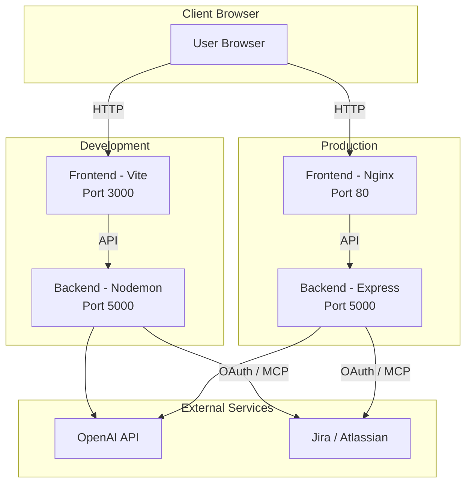

# Task Generator Web Application

A full-stack web application that automatically extracts structured tasks from meeting minutes using OpenAI's GPT models. The application consists of a React frontend and a Node.js/Express backend, with Docker support for both development and production environments.

## Features

- **AI-Powered Task Extraction**: Automatically extracts tasks from meeting minutes using OpenAI GPT models
- **Structured Task Output**: Generates tasks with subject, criteria, action items, assignee, and priority
- **Task Editing**: Edit, delete, and add new tasks after generation with full CRUD operations
- **Jira Integration**: Export tasks directly to Jira with OAuth 2.1 authentication
- **Bulk Operations**: Select and export multiple tasks to Jira at once
- **Export Status Tracking**: Track which tasks have been exported with Jira issue links
- **Modern UI**: Built with React and Tailwind CSS for a clean, responsive interface
- **Hot-Reload Development**: Fast development experience with Vite HMR and Nodemon
- **Docker Support**: Containerized development and production environments
- **Makefile Commands**: Unified command interface for all operations with environment-specific support

## Architecture



## Prerequisites

- **Node.js**: Version 20 or higher
- **npm**: Version 9 or higher
- **Make**: Usually pre-installed on Unix-like systems (macOS, Linux). For Windows, use WSL or install via package manager.
- **Docker**: Version 20.10 or higher (for Docker-based setup)
- **Docker Compose**: Version 2.0 or higher (for Docker-based setup)
- **OpenAI API Key**: Required for task generation functionality

## Quick Start

### Development Environment

```bash
make start
```

This will:
- Automatically create and configure environment files
- Create `docker.env` file for port configuration
- Prompt for your OpenAI API key
- Start services with hot-reload enabled

**Port Configuration:** Ports are configurable via the `docker.env` file. If you need to use different ports (e.g., if port 5000 is in use), edit `docker.env` before starting or after stopping services.

### Production Environment

```bash
make start ENV=prod
```

This will:
- Interactively configure production settings
- Set up CORS for your production domain
- Build and start services in detached mode
- Perform automatic health checks
- Display service status and access URLs

### Available Commands

View all available commands:
```bash
make help
```

Common commands:
- `make start` - Start development environment
- `make stop` - Stop services
- `make logs` - View logs
- `make status` - Check service status
- `make restart` - Restart services

For complete command reference, see [docs/DEVELOPMENT.md](docs/DEVELOPMENT.md).

## Installation

### Clone the Repository

```bash
git clone <repository-url>
cd task-generator
```

### Docker Setup (Recommended)

The easiest way to get started is using Docker with the Makefile:

```bash
make start
```

The make command will automatically:
- Create all necessary environment files
- Configure ports
- Prompt for required credentials
- Start the application

### Manual Setup

If you prefer to set up manually:

1. **Backend Setup:**
   ```bash
   cd backend
   npm install
   cp .env.example .env.development
   # Edit .env.development with your configuration
   npm run dev
   ```

2. **Frontend Setup:**
   ```bash
   cd frontend
   npm install
   cp .env.example .env.development
   # Edit .env.development with your API URL
   npm run dev
   ```

For detailed configuration instructions, see [docs/CONFIGURATION.md](docs/CONFIGURATION.md).

## Documentation

- **[Development Guide](docs/DEVELOPMENT.md)** - Complete guide for development, testing, and Makefile commands
- **[Configuration Guide](docs/CONFIGURATION.md)** - Environment variables and configuration options
- **[Deployment Guide](docs/DEPLOYMENT.md)** - Production deployment instructions
- **[API Documentation](docs/API_DOCUMENTATION.md)** - Complete API reference
- **[User Guide](docs/USER_GUIDE.md)** - Step-by-step user instructions
- **[Jira Setup Guide](docs/JIRA_SETUP.md)** - Jira integration setup
- **[Troubleshooting Guide](docs/TROUBLESHOOTING.md)** - Common issues and solutions

## Project Structure

```
task-generator/
├── backend/          # Backend application (Node.js/Express)
├── frontend/         # Frontend application (React/Vite)
├── docs/             # Documentation
├── scripts/          # Utility scripts
├── docker-compose.*.yml  # Docker Compose configurations
├── docker.env.example    # Port configuration template
├── Makefile          # Make commands
└── README.md         # This file
```

## Contributing

1. Fork the repository
2. Create a feature branch (`git checkout -b feature/amazing-feature`)
3. Make your changes
4. Run tests (`npm test`)
5. Commit your changes (`git commit -m 'Add some amazing feature'`)
6. Push to the branch (`git push origin feature/amazing-feature`)
7. Open a Pull Request

### Code Style

- Follow existing code style and patterns
- Run linters before committing: `npm run lint`
- Write tests for new features
- Update documentation as needed

## Team

- **Masoud Omidvar Rouzbahani** — [LinkedIn](https://www.linkedin.com/in/masoudomidvar/)
- **Amirhossein Dashtizadeh** — [LinkedIn](https://www.linkedin.com/in/amirhossein-dashtizadeh/)

## License

ISC

## Support

For issues, questions, or contributions, please open an issue on the GitHub repository.
